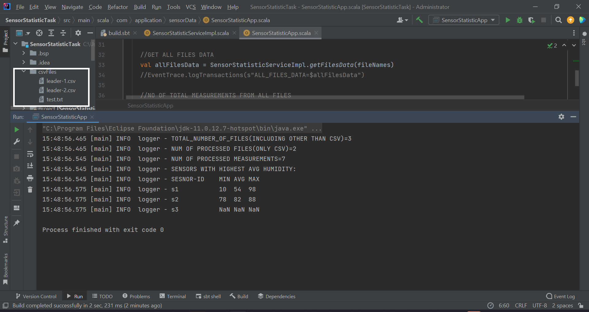
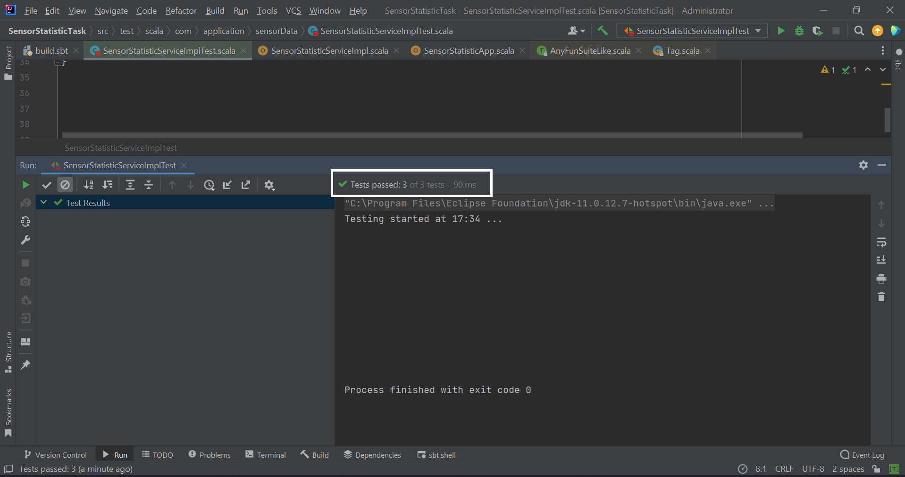

__####################################################################################__
# *APPLICATION DETAILS*
- *__`SensorStatisticApp`__ is the main class for this application.*
- *__`CSV Files`__ are stored in csvFiles directory for testing.*
- *__`APP Argument`__ to this application is directoryPath(i.e. args(0))=`csvFiles`.*

__####################################################################################__

*__`APPLICATION OUTPUT SCREENSHOT`__*

*__`TEST CASES PASSED SCREENSHOT`__*

